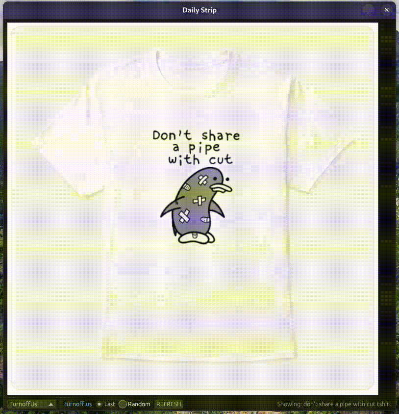
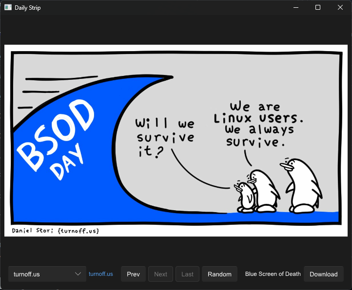

# daily-strip
Comic strips viewer



## Slint Frontend
By default ```egui_frontend``` is enabled.

To try out the _experimental slint frontend_ add the following: ``` --features slint_frontend --no-default-features```



## Supported sites
- [turnoff.us](https://turnoff.us)
- [monkeyuser](https://www.monkeyuser.com)
- [bonkersworld](https://bonkersworld.net)
- [goomics](https://goomics.net)
- [xkcd](https://xkcd.com)
- [dinosaur comics](https://www.qwantz.com)
- [oglaf](https://www.oglaf.com) [NSFW]
- [CTRL+ALT+DEL](https://cad-comic.com/)
- [The Joy of Tech](https://www.joyoftech.com/joyoftech/jotblog) 
- [Good Tech Things](https://www.goodtechthings.com)
- [Three Word Phrase](https://threewordphrase.com/index.htm)
- [a softer world](https://www.asofterworld.com)
- [BUTTERSAFE](https://www.buttersafe.com)
- [Questionable Content](https://questionablecontent.net)
- [Work Chronicles](https://workchronicles.com)
- [Junior Scientist Power Hour](https://www.jspowerhour.com)
- [Buttercup Festival](https://www.buttercupfestival.com)
- [Achewood](https://achewood.com)
- [Cat and Girl](https://catandgirl.com)
- [DIESEL SWEETIES #1.0](https://www.dieselsweeties.com/archive)
- [DIESEL SWEETIES #3.0](https://www.dieselsweeties.com)

